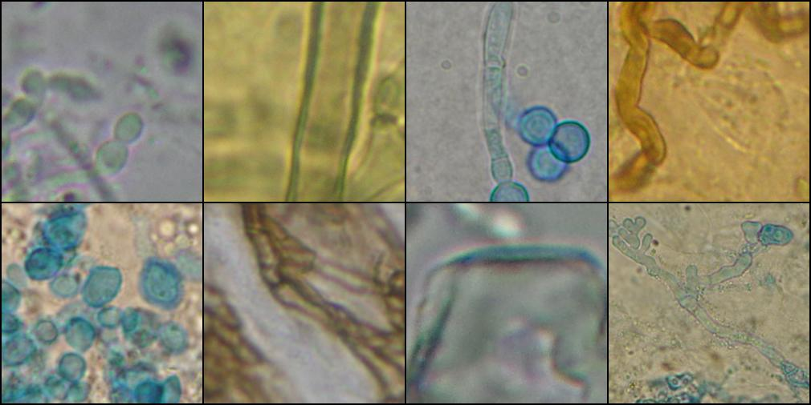

# FungiCV: Microscopic Fungi Image Classification


In this notebook I use the FastAI library to classify microscopic fungi images from the DeFungi dataset. This was done using transfer learning on ResNet and Vision Transformer (ViT) models. Achieved an overall accuracy of **~93%** compared to **~85%** from the original paper.  
[Kaggle Notebook](https://www.kaggle.com/code/balkarjun/fungi-image-classification-using-fastai-93-acc)

### About the Dataset
DeFungi is a dataset containing 9000+ microscopic fungi images. The images are from superficial fungal infections (estimated to affect around 1 billion people worldwide) caused by yeasts, moulds or dermatophyte fungi.

The images are labelled into five classes (representing five fungi types), and cropped to the region of interest.

Source: [Dataset](https://archive.ics.uci.edu/dataset/773/defungi), [Paper](https://arxiv.org/abs/2109.07322)

### Usage
To run the `fungicv.ipynb` notebook, you will need the [fastai](https://docs.fast.ai/#installing) library.
```
pip install fastai
```
Then, download the dataset and place it in a folder named `data`. Alternatively, you can change the image path to your liking by modifying it in the notebook.

The `collage.py` file contains the code I wrote to create the image you see at the start of this README. You will need the [pillow](https://pillow.readthedocs.io/en/stable/installation/basic-installation.html) library to run this file, which is installed automatically when you install fastai.
